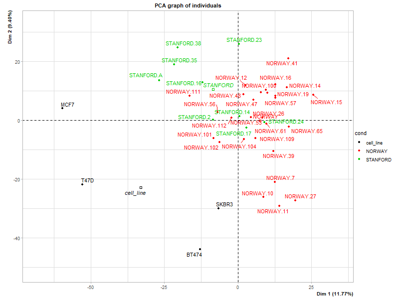
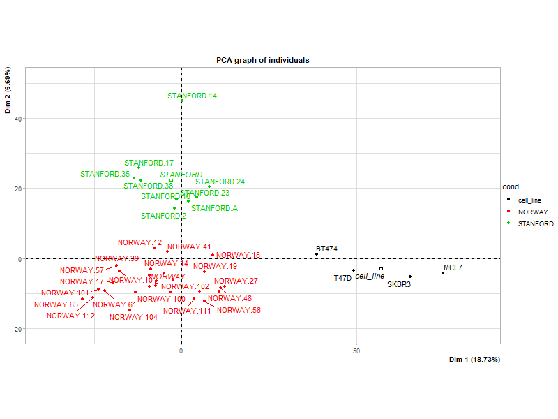
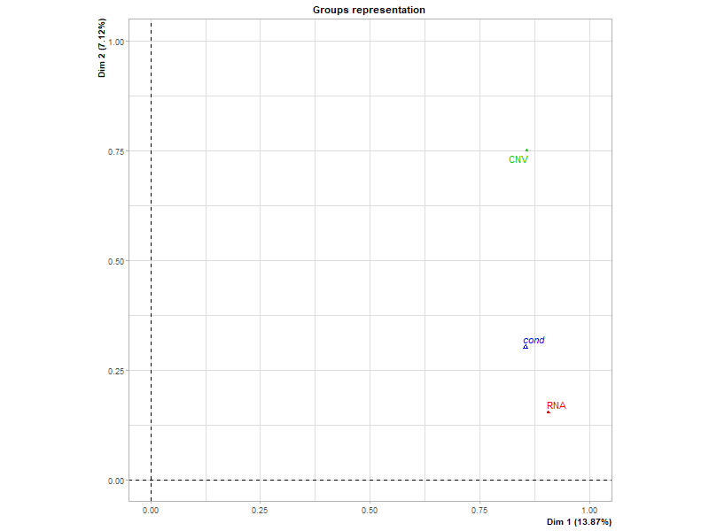
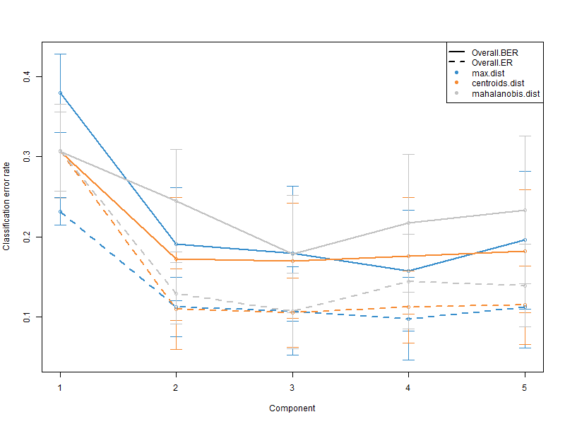
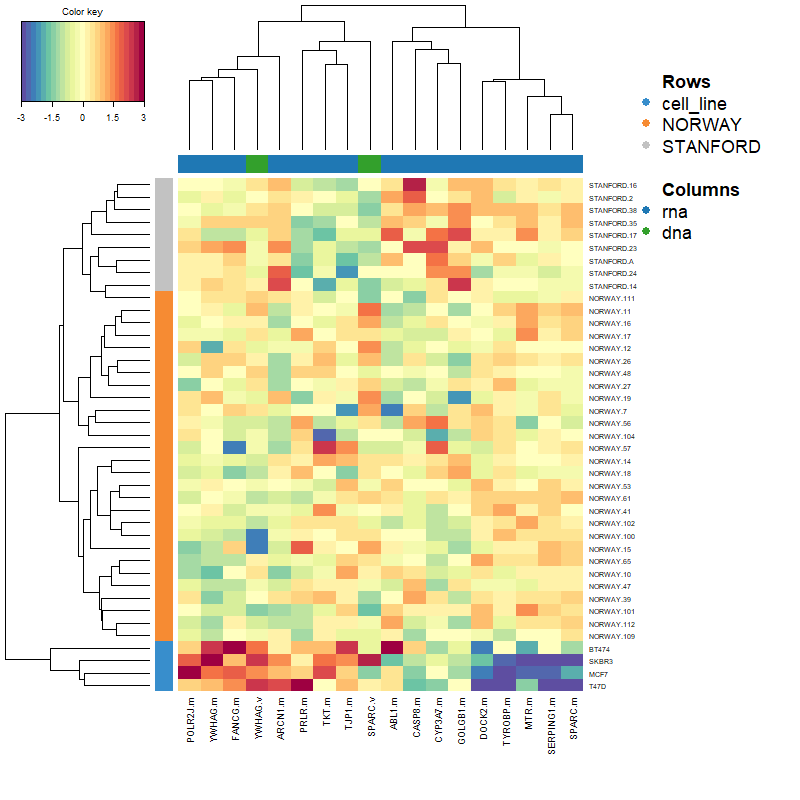

 # Multi-Omics Integration Pipeline: Breast Cancer CNV and Gene Expression
 
This project showcases a computational pipeline designed to integrate and analyze DNA copy number variations (CNV), although alterations would be the proper term for changes in somatic cells, and gene expression data. The analysis focuses on breast cancer samples, demonstrating the application of advanced N-dimensional approaches to identify correlated biological patterns across different omics layers.

## 1. Data and structure

The data comes from [Pollack J. R. et al. (2002)](https://pubmed.ncbi.nlm.nih.gov/12297621/). It was generated using a two-color microarray containing 6,691 genes. Each sample was hybridized against the same reference (a normal female leukocyte sample), meaning all expression and CNV values are presented as ratios. The experiment includes 41 samples, 4 breast cancer cell lines, 28 clinical samples from Norway, and 9 clinical samples from Stanford. 

The core data is stored in the pollack.RData file, which contains two primary data frames:

- pollack: Contains information for all samples across all chromosomes.
- pollack.nox: Contains information for all samples across all chromosomes, except for the X chromosome to avoid sex chromosome bias.

The dataset contains the following variables:
- CLID: Original microarray ID.
- NAME: Information about the gene and its genomic location, separated by a pipe ("|").
- X1X-X5X: Copy number alterations of five baseline samples.
- BT474-T47D: Copy number alterations of the four breast cancer cell lines.
- NORWAY.7-NORWAY.112: Copy number alterations of the Norway sample.
- STANFORD.2-STANFORD.A: Copy number alterations of the Stanford sample.
- BT474.mRNA-T47D.mRNA: Gene expression profiles of the four breast cancer cell lines.
- NORWAY.7.mRNA-NORWAY.112.mRNA: Gene expression profiles of the Norway sample.
- STANFORD.2.mRNA-STANFORD.A.mRNA: Gene expression profiles of the Stanford sample.
- gene: Gene HGNC Symbol.
- chr: Chromosomal location.
- start: Starting position in the chromosome.
- end: Ending position in the chromosome.

## 2. Analysis and Results

### Data analysis using FactoMineR R-package to the Pollack experiment

FactoMineR is an R package dedicated to exploratory multivariate data analysis. In this pipeline, it is used to perform an unsupervised Multiple Factor Analysis (MFA), which integrates the RNA expression and DNA copy number datasets without supplying prior sample labels. This approach reveals the natural biological variance and structural groupings within the data, highlighting which specific omics layers and genes are responsible for the differentiation between breast cancer cell lines and clinical samples.

Before combining the data into a Multiple Factor Analysis (MFA), let's explore the structure of each omics layer to make sure there is no outliers or clear batch effect. CNVs indicate if cancer cells have changed the structure of the DNA by deleting or amplifiying gene copies, meanwhile the expression analysis measures the mRNAs, the level of expression of each gene.

#### CNV PCA

Although the PCA analysis reveals clear differences between the cell lines and the clinical samples, it shows a lot of overlapping between Stanford and Norway samples.

#### Expression PCA

The expression PCA clearly shows differences between the cell lines and the rest of the samples (in dim 1) and also between Stanford and Norway samples (in dim 2).

#### MFA
Now let's perform a MFA. We can't simply merge the RNA and CNV tables and run a standard PCA, the dataset with higher variance (or more variables) would completely dominate the results. The MFA() function prevents this by mathematically weighting each block (dividing each by its first principal eigenvalue) so that the RNA block and the CNV block have an equal say in the final geometric space.

The MFA Groups representation plot reveals how each omics block contributes to the overall differences. Dimension 1 (13.87% variance) is driven equally by both the transcriptomic (RNA) and genomic (CNV) blocks, representing a shared biological signature. This first dimension also captures the variance introduced by the biological differences between cell origin (cond). Dimension 2 (7.12% variance) is driven almost entirely by the CNV block, capturing structural genomic variance that is independent of gene expression.

These tables show the top 10 most relevant genes for each dimension of the MFA. For dimension 1 the genes come from the RNA expression block and for dimension 2 from the CNV block. This selection is based on the MFA results, since each block seem to have more effect on its respective dimension.

#### Genes dimension 1 (mRNA)
| Gene | Chr | Start | Value |
| :--- | :--- | :--- | :--- |
| *ACTA2* | 10 | 88,935,074 | 0.9139 |
| *ANXA1* | 9 | 73,151,757 | 0.8836 |
| *C1R* | 12 | 7,080,209 | 0.9071 |
| *COL3A1* | 2 | 188,974,320 | 0.8747 |
| *COL4A2* | 13 | 110,305,812 | 0.8625 |
| *FCGR2B* | 1 | 161,663,147 | 0.8730 |
| *IGFBP7* | 4 | 57,030,773 | 0.8891 |
| *IL6* | 7 | 22,725,884 | 0.8865 |
| *LRP1* | 12 | 57,128,493 | 0.8644 |
| *LUM* | 12 | 91,102,629 | 0.8912 |

#### Genes dimension 2 (CNV)
| Gene | Chr | Start | Value |
| :--- | :--- | :--- | :--- |
| *ACTN3* | 11 | 66,546,395 | 0.6886 |
| *BLVRA* | 7 | 43,758,680 | 0.7626 |
| *CHGB* | 20 | 5,911,430 | 0.7274 |
| *ENTPD6* | 20 | 25,195,693 | 0.7943 |
| *HOOK1* | 1 | 59,814,786 | 0.7569 |
| *IGFBP1* | 7 | 45,888,357 | 0.7230 |
| *IGFBP3* | 7 | 45,912,245 | 0.6922 |
| *LFNG* | 7 | 2,512,529 | 0.7447 |
| *MADD* | 11 | 47,269,161 | 0.6878 |
| *SLC2A1* | 1 | 42,925,375 | 0.6726 |

The Value column represent the correlation coefficient between the gene's expression or CNV ratio and the dimension of the MFA, indicating its contribution to the variance.

Check [this circos plot](results/mfa_circos.pdf) to see a visual representation of the chromosome position and effect (the file is in PDF because uses a vector format and allows for greater resolution than a PNG or JPG).

### Apply the DIABLO method using mixOmics R-package

mixOmics is a specialized package for the supervised integration and feature selection of highly dimensional biological datasets. Its framework Data Integration Analysis for Biomarker Discovery using Latent Variable Approaches for Omics Studies (DIABLO) is used to actively search for a sparse, highly correlated multi-omics signature that optimally discriminates between defined sample origins (Norway, Stanford, and cell lines). By mathematically tuning the model to keep only the most informative features, this step provides a robust, predictive biomarker panel and a distinct molecular heatmap that perfectly separates the experimental groups.

#### Model component selection test

This plot evaluates the DIABLO model's classification error rate across 5 potential components. Two components seem the most appropiate choice, because the error rate drops sharply from the first to the second component, but plateaus or slightly increases thereafter, indicating that adding more dimensions does not meaningfully improve the model's predictive accuracy.

#### Expression block selected genes (Comp 1)
| Gene | value.var |
| :--- | :--- |
| *ARCN1.m* | -0.91250205 |
| *SERPING1.m* | 0.29114809 |
| *GSS.m* | -0.21849347 |
| *YWHAG.m* | -0.17021696 |
| *FANCG.m* | -0.07654798 |

#### CNV selected gene
| Gene | value.var |
| :--- | :--- |
| *AMPH.v* | -1 |

DIABLO has successfully built a highly sparse model, it shrunk the multi-omics signature down to the absolute bare minimum needed to classify the cell lines. Just 5 genes and 1 CNV for component 1.

To interpret the final multi-omics signature selected by the DIABLO algorithm, a Clustered Image Map (CIM) was generated.

The hierarchical clustering perfectly isolates the breast cancer cell lines (BT474, SKBR3, MCF7, T47D) into their own distinct clade. This confirms that the selected mRNA and CNV features form a robust signature capable of distinguishing in vitro models from primary clinical tumors. The clade also correctly classifies the Standford and Norway samples although they share more homogenous expression and alteration patterns across the selected genomic signature.

The heatmap maps the selected features across all model components. Biomarkers from the transcriptomic block (RNA, denoted by .m) and the genomic block (DNA, denoted by .v) work together to form visual blocks of up-regulation (red) and down-regulation (blue) that define the sample origins.

To see more plots regarding the model, check [this pdf](results/DIABLO_plots.pdf).

#### Check model predictive power
| | predicted.as.cell_line | predicted.as.NORWAY | predicted.as.STANFORD |
| :--- | :---: | :---: | :---: |
| **cell_line** | 4 | 0 | 0 |
| **NORWAY** | 0 | 28 | 0 |
| **STANFORD** | 0 | 0 | 9 |

In order to quantitatively evaluate the discriminative power of the final DIABLO multi-omics model, a confusion matrix was generated by predicting the sample origins using the Centroids Distance metric. The model achieved perfect classification accuracy on the training set, successfully categorizing all 41 samples into their correct respective groups (Cell line, Norway, or Stanford) without a single misclassification.

The 0% training error rate confirms that the strictly filtered subset of genomic (CNV) and transcriptomic (mRNA) features selected by the model is highly robust. Despite the molecular similarities between the Norway and Stanford clinical cohorts observed in earlier unsupervised analyses, the supervised mixOmics approach successfully identified a latent mathematical signature capable of completely distinguishing them.

### Conclusions

This multi-omics pipeline successfully demonstrates the power of combining CNV data with gene expression data to resolve complex classification of breast cancer samples. Initial exploratory analysis revealed that the transcriptomic layer alone has substantial discriminative power, PCA on gene expression successfully separated the in vitro cell lines along the primary dimension and cleanly distinguished the Stanford and Norway clinical cohorts along the second dimension. By evaluating these omics layers simultaneously using MFA, the model further revealed that the primary sample variance is driven by a shared transcriptomic and genomic signal, whereas the secondary variance is almost entirely driven by copy number alterations.

While unsupervised methods successfully grouped the samples, the supervised DIABLO also provided excellent results, successfully classifying the different samples using both omic layers. The test shows it can classify all sample origins with a 0% training error rate, using just two model components. Across all visual outputs, including the final Clustered Image Map, the breast cancer cell lines consistently formed a distinct structural and transcriptional outgroup. Considering the primary component relies on just 18 biomarkers, it is an impressive result. Ultimately, this pipeline shows how multi-omics integration allows for efficient and reliable classification. This is extremely important, especially when treating cancer using hyper specialized drugs, where identifying the subtype of cancer is vital for the survival of the patient.
